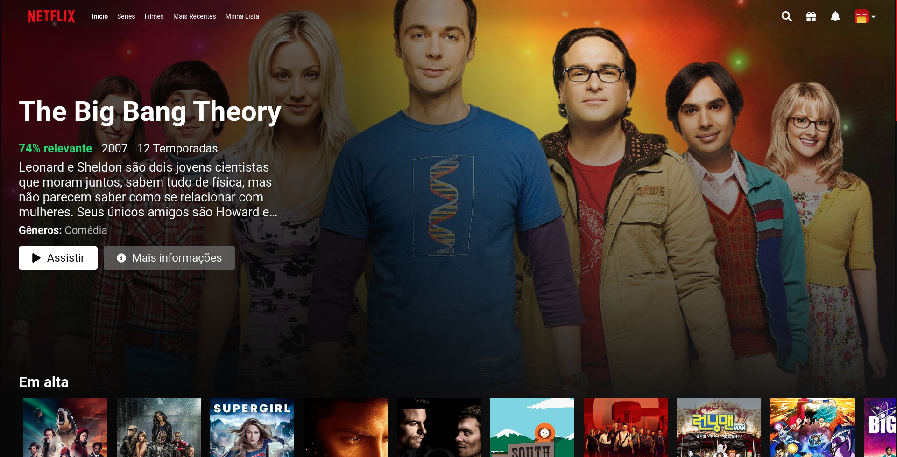

  

<h3 align = "center" fontSize="60px">
  Clone da plataforma de streaming <a href="https://www.netflix.com/">Netflix</a>
</h3>

  

## :rocket: Tecnologias

-  [React.js](https://pt-br.reactjs.org/)
-  [JavaScript](https://www.javascript.com/)
-  [Styled-Components](https://styled-components.com/)
-  [Axios](https://github.com/axios/axios)
